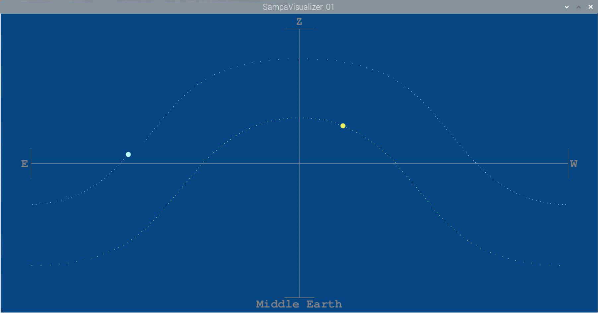

# StarGazer
## Another Raspberry Pi Telescope

The idea for this project came out of conversations with a friend, Gregory, many years ago. We were just BS-ing about working on something and the notion of a solar tracker for Sun observation and photography came up. Lots of cool problems to solve in it. Motor control, Mechanical positioning drive, electronics and programming. We were planning to hack a web cam and glue it to the back of an old telephoto lens. I had gotten as far as that before the project died. Got some cool images, and learned about how to dial in the focal point for the image sensor. But it never went anywhere, just a thought, until the Fall of '20 I saw that the Raspberry Pi had come out with a new [high def camera](https://www.adafruit.com/product/4561), and it was basically just the bare image sensor PCB with a lens mount. I had been messing around with Raspberry Pi 4 for a client, and figured no time like the COVID lockdown for a project.

This time, It feels like it's really going to happen.

## Current State

Screen shot of the sampaVisualizer running. The Z point on the graph is straight up at my location, and the E and W points are actually wrap-around of North. My Altitude is measured as an angle down from the zenith, and my Azimuth is measured Eastward from North. This Processing sketch is a proof of coms with the Sampa Server, and evidence that the Sampa Server is serving correct values.
 

## Project Outline

Without knowing anything about astronomy and telescopes, I dove head first into the design problem. First, I had to establish the process for positioning. I figured I would use [worm gear]()s to drive the horizontal and vertical axes (Azimuth and Altitude). Also [stepper motors](https://www.adafruit.com/product/4411) to move them for accurate positioning. In order to know which end was up (meaning North) I figured I would need a digital compass ([magnetometer](https://www.adafruit.com/product/4479)), and in order to know when my lens was level with the horizon (or pointing straight up to the Zenith) I would use an [accelerometer](https://www.adafruit.com/product/3387).

My go-to coding tool for apps is Processing, and it turns out that as of this writing, Processing for Raspberry Pi is not getting alot of support. Still works, but might be a little buggy, with little recourse except the forums. Not a problem, I thought.

In my initial stabs at getting the Magnetometer to work had little success. There is something kooky happening deep in the Processing I2C that does not play well with the magnetometer that I'm using. I also had some issues with controlling the [motor hat](https://www.adafruit.com/product/2348) that I though would be perfect. From what I can tell, the problem has something to do with clock stretching during the I2C transactions and the Processing I2C library does not allow for it. Instead of jumping ship from Processing to Python, I decided to just use an Arduino to do the low-level sensor and motor control. With the RasPi 4, it is a breeze to set up Arduino IDE and now I can program the Arduino (Leonardo) and communicate via the USB UART with ease. 

The other major hardware component is the Raspberry Pi POE Hat, which is absolutely fantastic, I have a good sized POE injector, and plan to mount the final piece on the roof of my building, so ethernet and power is a super win. One cord to rule them all!

I figure I can do all the software to read sensors, drive motors and position the camera, no problem. The hard part is how to know the position of the Sun/Moon/Other thing in the sky? After researching and googling, I found a book that lead me to the [Solar And Moon Position Algorithm](https://midcdmz.nrel.gov/sampa/) (SAMPA). The algorithm is written in C, which is perfect for the Raspberry Pi, and so with some modification of their example code I am able to have a Processing Sketch launch the SAMPA send it a time stamp every minute, and receive the azimuth and altitude of the Sun and Moon. I have hard-coded my values for my location longitude and latitude. There are also some time coefficients, average barometric pressure and temperature that need to be thrown in there. 

Now that I have the ability to get the sun and moon position on the fly, I can start to work out the mechanics of my positioning system. Finding the right gear ratio is not the easiest task, and finding readily available gears at reasonable cost is also not trivial. I at first thought that I would print the mechanics, but temps are too varied and deformation of the gears is the last thing I need. After shopping around and determining what gear ratios are available, I decided on a 72:1 reduction of the worm gearing using [this gear](https://www.amazon.com/gp/product/B004N84ZYC/ref=ppx_yo_dt_b_asin_title_o00_s00?ie=UTF8&psc=1) and the attendant worm. With the stepper from Adafruit, I get the following

Stepper Steps Per Rotation  | Degrees per Tooth | Steps per Degree | Degrees per Step
:-------------: | :-------------: | :--------------: | :-------:
200 | 5 | 40 | 0.025

Since I'm getting the Azimuth and Altitude values in decimal from the Sampa Server, this resolution is acceptable. The worm drive and gear mate together well, so I should not have any issues with backlash once I get them aligned and mounted.

The next critical verification is to make sure that my compass is not too adversely effected by the motors or other metallic things in the build. I have sourced an aluminum rotational bearing, and I'm planning to use plastics and other non-ferrous where I can. The Compass only needs to measure North, so if I keep everything as far away from that orientation, I hope to get the least amount of field distortion. But, in order to do that testing and calibration, I really need the mechanical system running. That means my first step is going to be designing the mechanics! Yay!
